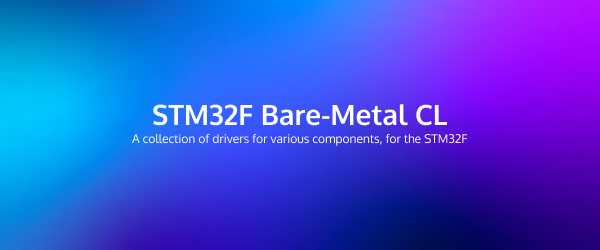

# STM32F4-BMCL
A Bare-Metal Component library (BMCL) for STM32F4 Series Chips. Done using only C and Assembly Language with manufacturer documentations. 

</img>

#### Quick Demo of LCD & HCSR04

https://github.com/steven-mu12/STM32F4-BMCL/assets/62585035/1834d41c-cd0b-4a6b-98e8-7bb14b566c2b

## List of Supported Components + Drivers
- GPIO Driver capable of digital input / output
- Delay (ms accurate, using Systick & Interrupt - us accurate using hardware timer TIM2)
- 1602A LCD Display
- HC-SR04 Ultrasonic Distance Sensor
- SSD1306 OLED display via I2C (Coming soon!)
- SG90 Servo Motor Analog Control (Coming soon!)

## Usage
1. download the inc and src folders and add them to working directory
2. make sure to include the header file of the component you are trying to use
3. read the documentation for each library in the "docs" folder, as well as check out some example code snippets in the "examples" folder

## Contribute
You are welcomed to contribute to this repository, if you have another component that you would add support for, please open a PR. Note that everything must be built off resources in this repository, as to make this an independent project that isn't dependent on any external sources

## License
MIT License - Permission is hereby granted, free of charge, to any person obtaining a copy of this software and associated documentation files (the "Software"), to deal in the Software without restriction, including without limitation the rights to use, copy, modify, merge, publish, distribute, sublicense, and/or sell copies of the Software, and to permit persons to whom the Software is furnished to do so, subject to the following conditions:

The above copyright notice and this permission notice shall be included in all copies or substantial portions of the Software.

THE SOFTWARE IS PROVIDED "AS IS", WITHOUT WARRANTY OF ANY KIND, EXPRESS OR IMPLIED, INCLUDING BUT NOT LIMITED TO THE WARRANTIES OF MERCHANTABILITY, FITNESS FOR A PARTICULAR PURPOSE AND NONINFRINGEMENT. IN NO EVENT SHALL THE AUTHORS OR COPYRIGHT HOLDERS BE LIABLE FOR ANY CLAIM, DAMAGES OR OTHER LIABILITY, WHETHER IN AN ACTION OF CONTRACT, TORT OR OTHERWISE, ARISING FROM, OUT OF OR IN CONNECTION WITH THE SOFTWARE OR THE USE OR OTHER DEALINGS IN THE SOFTWARE.

## Contact
For any inquiries, please reach out to xsmu0922@gmail.com

