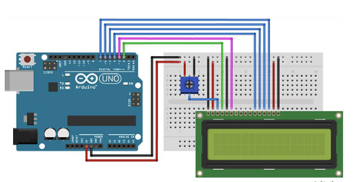

# 1602A LCD Usage Guide
Based on displays using the Hitachi HD44780 controller

## Important Info (READ)

There are several things to keep in mind when using this driver.
1. This library is built on top of the GPIO and DELAY components that I built, which means you need to have delay.h & gpio.h in the inc folder, as well as delay.c & gpio.c in the src folder
- This also means that you CANNOT use another library to handle GPIO and delay operations
- The files mentioned above are located in the repository

2. Currently support 2-line, 5x8 characters and fastest command speed possible. Ability to shift entire display, read data and custom characters with CGRAM are coming soon

3. Also note that this is specific on how to USE this library, NOT how a 1602A LCD works. For that, read this datasheet https://www.sparkfun.com/datasheets/LCD/ADM1602K-NSW-FBS-3.3v.pdf

## Hardware Schematic
<b>(Pretend that the arduino is an STM32F4 nucleo board)</b>

*make sure to ground RW for now. Support for read coming*
*use 5v for VDD to make things easier*
 
 
## Functions
<b> void initDisplay( struct lcd *lcd, uint16_t D4i, uint16_t D5i, uint16_t D6i, uint16_t D7i, uint16_t RSi, uint16_t Ei ); </b>
- This initializes the display. Provide it the LCD struct you initiated and GPIO pins you defined when using it in the main function (SEE SAMPLE CODE ON REPO FOR HOW TO DO THIS)

<b>void clearDisplay( struct lcd *lcd );</b>
- Clears the display and returns the cursor home to 0, 0

<b>void writeDisplay( struct lcd *lcd, char *data, int length );</b>
- Write a string to the display. You also need to provide the length of the string. For how to do this, see the sample code again in the repo

<b>void setCursor( struct lcd *lcd, int row, int col );</b>
- Set the cursor to whichever position is desired on the 16x2 display. 
 
Note that if you read the source code, you may notice the “low-level functions” that are also there. It’s recommended that users do not touch those