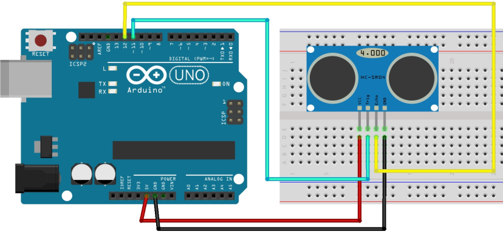

# HCSR04 Usage Guide

## Important Info (READ)

There are several things to keep in mind when using this driver.
1. This library is built on top of the GPIO and DELAY components that I built, which means you need to have delay.h & gpio.h in the inc folder, as well as delay.c & gpio.c in the src folder
- This also means that you CANNOT use another library to handle GPIO and delay operations
- The files mentioned above are located in the repository

2. Current the output is in cm, outputted as an uint32_t value. If you would need to display this as a string, follow the code in the samples folder

3. Also note that this is specific on how to USE this library, NOT how the sensor works

4. Very important: MAKE SURE TO INITIALIZE BOTH the US and MS timers for this to work correctly! See code in samples folder

## Hardware Schematic
<b>(Pretend that the arduino is an STM32F4 nucleo board)</b>

## Functions
<b> void hcsr04Init( struct hcsr04 *sensor, uint16_t trigger, uint16_t echo ); </b>
- This initializes sensor. Provide it the hcsr04 struct you initiated and GPIO pins you defined when using it in the main function (SEE SAMPLE CODE ON REPO FOR HOW TO DO THIS)
- Also note that the echo pin is a digital INPUT pin, so be sure to select a viable pin for it

<b> uint32_t measureDistance( struct hcsr04 *sensor ); </b>
- runs a distance measuring cycle, returns the distance in cm as a uint32_t value. Again, if need to display as string, follow example in sample folder
